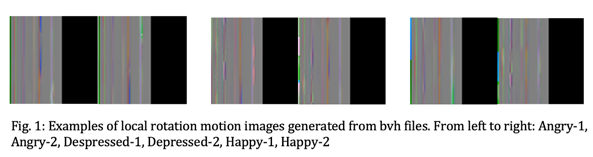

# VGG Classifier For Motion Images
 
#### Train to classify the BVH textures with labels

# How to use

### 1. Python environment
Configure python environment according to requirements.txt

### 2. Datasets
The datasets are generated from bvh files by VAT_Exporter.
The local and world positions and rotations are extracted from the original bio-vision hierarchy files, and stored to tiff images.  The datasets are all standardised and sliced into uniform animation clips, as the clips are of different lengths and coordinates. Overlapping frames are used to enlarge the datasets. To extract the key information and remove the redundant data, the motion clips are down-sampled to 30 frames per second, and the sampling is interlaced.  Over 10,000 clips have been produced, with an overlap of 16 and a frame count (sliced clip length) of 80 empirically. Details could be found in VAT_exporter project.
Then the train and test data are devided with a ratio of 9:1 and store them to motion_data/test and motion_data/train.

### 3. Train
Train the datasets by running vgg_train.py.

### 3.  Test the result
modify the model_path in line 70 in vgg_classify.py and run vgg_classify.py. The system will output the predicted label with the highest score.

